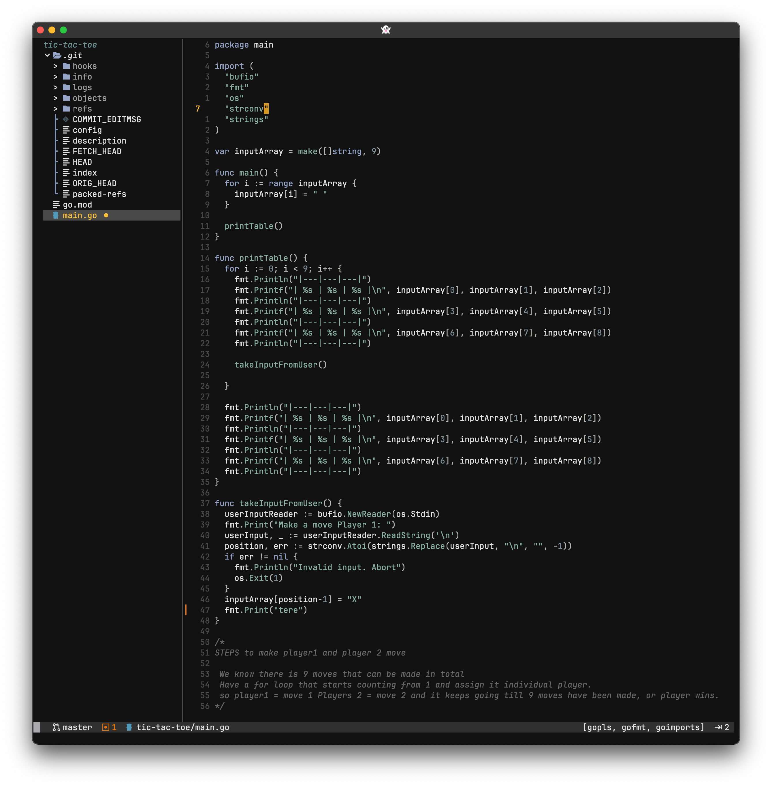

<div align="center">

#
logo here

</div>

---
<div align="center"><p>
    <a href="https://github.com/lpuljic/nox-modus.nvim/pulse">
      
    </a>
    <a href="https://github.com/lpuljic/nox-modus.nvim/stargazers">
      
    </a>
</div>


# nox-modus

nox-modus is inspired monotone theme, hence the name `nox` `modus`, meaning `night mode` in Latin.

<summary><h2>🎨 Palette</h2></summary>

| name        |                           hex                            | name         |                           hex                            |
| :---------- | :------------------------------------------------------: | :----------- | :------------------------------------------------------: |
| fg          |  | red          |  |
| bg          |  | orange       |  |
| gray01      |  | yellow       |  |
| gray02      |  | grayish_blue |  |
| gray03      |  | light_blue   |  |
| gray04      |  | md_blue      |  |
| gray05      |  | md_orange    |  |
| gray06      |  | cursor_fg    |  |
| green       |  | cursor_bg    |  |
| blue        |  | DiffAdd      |  |
| purple      |  | DiffDelete   |  |
| DiffChange  |  | DiffText     |  |

</details>


## Install

[packer](https://github.com/wbthomason/packer.nvim)

```lua
use "lpuljic/nox-modus.nvim"
```

[vim-plug](https://github.com/junegunn/vim-plug)

```vim
Plug 'lpuljic/nox-modus.nvim'
```

[lazy](https://github.com/folke/lazy.nvim)

```lua
{ "lpuljic/nox-modus.nvim" }
```

## Configuration

Add this somewhere in your configuration.

```lua
vim.cmd.colorscheme("nox-modus")
```


